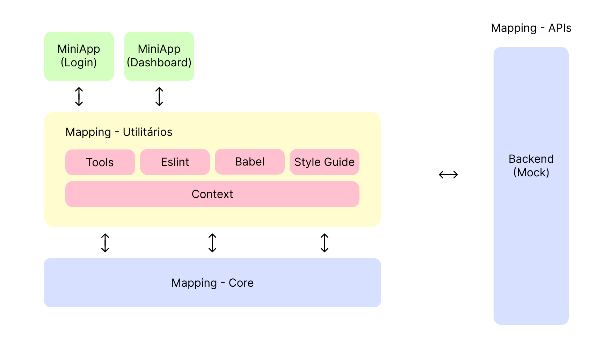
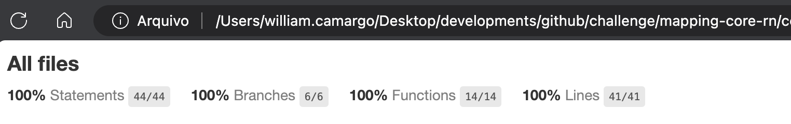

# Nova arquitetura e fluxo da hierarquia dos times

- Status: proposta (desafio)
- Decisores: Lucas Oliveira e Adriano Rodrigues
- Executor: William Camargo
- Data: 12/03/2024

## Utilitários

- [Backlog](https://db1global-my.sharepoint.com/:x:/g/personal/william_camargo_db1_com_br/EXWyP3xPMpxAkyHBB6o8fz0B3Y4Gkg_Jx21Oa9E4-D7Knw?e=D0Kpdg)
- [Figma e design](https://www.figma.com/file/y427586uuFXcvODlMgNTtU/MySpace_Desafio?type=design&node-id=96-529&mode=design&t=B4YIplPTnrZy1MV8-0)

## Contexto

O Myspace tem se tornado uma aplicação cada vez mais utilizada, a qual a manutenção, desenvolvimento de novas features e distribuição das tarefas entre as equipes tem se mostrado verdadeiros desafios. Para manter a qualidade, performance e expansão de novas funcionalidades, julga se necessário alterar sua arquitetura para uma arquitetura modularizada, semelhante ao de microfrontends, a qual permitirá a colaboração entre as equipes de maneira mais ágil e fluída.

## Declaração do desafio

Desenvolver uma aplicação utilizando uma arquitetura baseada em microfrontends junto aos conceitos de offline fisrt, nesta aplicação deve ser possível realizar o login social como Google, Facebook ou conta Microsoft utilizado na DB1. É esperado que a aplicação respeite os princípios SOLID e que seja utilizada uma arquitetura que faça com que o código seja independente do framework utilizado, sendo possível a reutilização de grande parte do código gerado em outras aplicações ou frameworks.

## Decisões chaves

- Arquitetura modularizada facilita o gerenciamento dos diferentes módulos
- Manutenibilidade, testes unitários e de integração, expansão em novas módulos e desenvolvimento de novas funcionalidades
- Permite que o projeto tenha elasticidade tanto na formação quanto na diminuição dos times a depender dos objetivos
- Separação entre os módulos sobre o que diz respeito as configurações, funcionalidades e responsabilidades que cada um tem sobre o projeto como um todo

## Arquitetura exemplificada

## Resultado

Aplicação funcional, módulos separadas e funcionando de maneira independente a qual permite o desenvolvimento das funcionalidades de forma padronizada com fluides, performance, e manutenível.

### Consequências positivas

- Desenvolvimento e atualizações independente
- Reusabilidade de código
- Escalabilidade
- Tecnologias diversificadas
- Isolado de falhas
- Colaboração entre as equipes

### Consequências negativas

- Complexidade inicial no seu desenvolvimento
- Sincronização das versões
- Aprendizado e curva de adoção

## Observações adicionais sobre a arquitetura escolhida

- Módulos que funcionam de maneira independente, permitindo que equipes possam trabalhar em produtos diferentes sem comprometer a evolução de um produto específico fazendo seu gerenciamento e suas entregas para no fim juntar todos em um único fluxo
- Problemas isolados, quando houver algum problema será possível resolvê-lo de forma isolada, removendo o acesso ao módulo ou obtendo solução imediata
- Entregas mais granulares, maior qualidade e agilidade
- Se torna muito mais simples sua evolução e crescimento, permitindo adicionar novos produtos com funcionalidades (escalável)

## Principais desafios & evoluções

- Arquitetura, configurações de ambiente e integração entre os módulos
- Limitação técnica para determinadas funcionalidades
- Organização e orquestração no desenvolvimento das tarefas
- Gerenciamento de tempo para a finalização das tarefas
- Conhecimento técnico adquirido na prática

## Repositórios

Repositórios utilizados no desenvolvimento da aplicação

- [babel-preset-rn-mapping](https://github.com/williamcamasil/babel-preset-rn-mapping)
  - **Objetivo:** é responsável por centralizar toda configuração e dependência necessária para uso do Babel nos repositórios mapping, sendo instalado como dependência.
- [eslint-config-rn-mapping](https://github.com/williamcamasil/eslint-config-rn-mapping)
  - **Objetivo:** é responsável por tratar problemas no código JavaScript, aplicando um conjunto de regras predefinidas ou personalizadas, sendo instalado como dependência.
- [mapping-tools-rn](https://github.com/williamcamasil/mapping-tools-rn)
  - **Objetivo:** é o repositório responsável por centralizar scripts e ferramentas úteis para o desenvolvedor. É usado como dependência nos repositórios do SuperApp para compartilhar scripts e configurações de ferramentas como jest, typescript e commitlint.
- [mapping-context-rn](https://github.com/williamcamasil/mapping-context-rn)
  - **Objetivo:** é o repositório responsável por centralizar componentes não visuais, sem regra de negócio, para serem utilizados nos repositórios do SuperApp. Ele possui componentes como contextos compartilhados (usuário logado), hooks.
- [mapping-style-guide-rn](https://github.com/williamcamasil/mapping-style-guide-rn)
  - **Objetivo:** é o repositório responsável por centralizar os componentes do Design System utilizado no SuperApp. Também centraliza qualquer componente que esteja relacionado à estilo, como hooks e providers de tema, sem conter regras de negócio.
- [mapping-login-rn-app](https://github.com/williamcamasil/mapping-login-rn-app)
  - **Objetivo:** o repositório responsável por features de autenticação do MappingApp. É instalado como dependência submódulo do repositório central mapping-core-rn.
- [mapping-dashboard-rn-app](https://github.com/williamcamasil/mapping-dashboard-rn-app)
  - **Objetivo:** é o repositório responsável por features de dashboard e fluxos do organograma do MappingApp. É instalado como dependência submódulo do repositório central mapping-core-rn.
- [mapping-core-rn](https://github.com/williamcamasil/mapping-core-rn)
  - **Objetivo:** é o repositório central do SuperApp, responsável por unir todas as dependências, funcionalidades e configurações, permitindo ter acesso total a aplicação. Possui todos os repositórios MiniApp submódulo e utilitários instalados como dependência.

## Aplicação em tempo real

### Android usuário padrão

### Android usuário admin

### Android login com conta social

### iOS

## Cobertura do código

## Referencias
- [Documentação Firebase com React Native](https://rnfirebase.io/)
- [Documentação Firebase Autenticação](https://rnfirebase.io/auth/social-auth)
- [Documentação Google Sign in](https://github.com/react-native-google-signin/google-signin?tab=readme-ov-file#project-setup-and-initialization)

